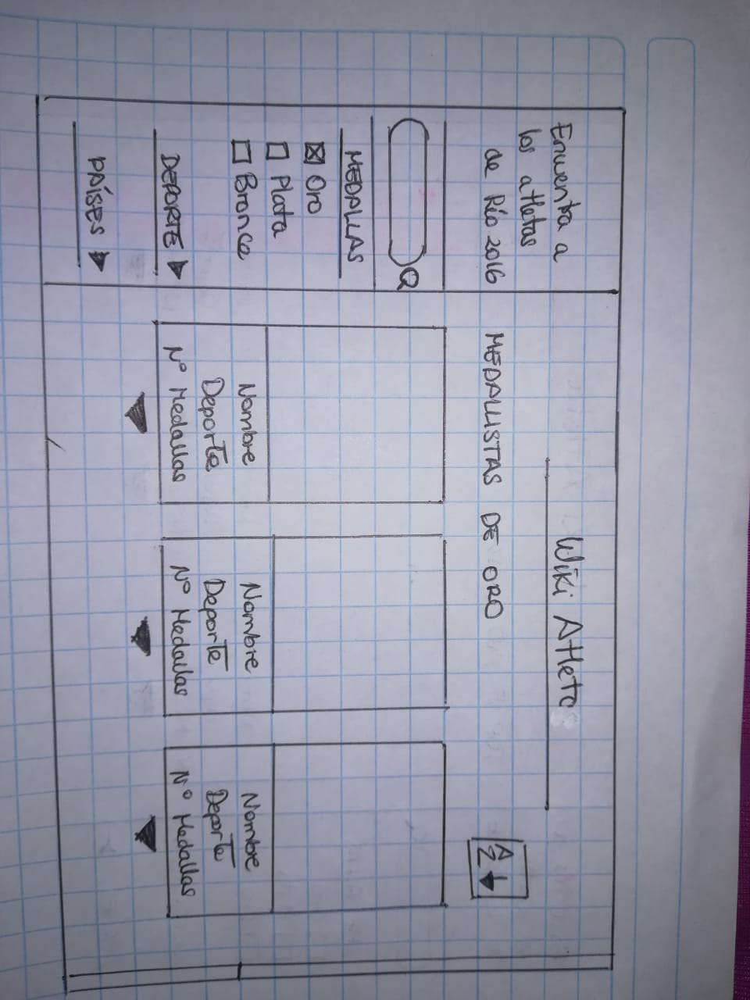
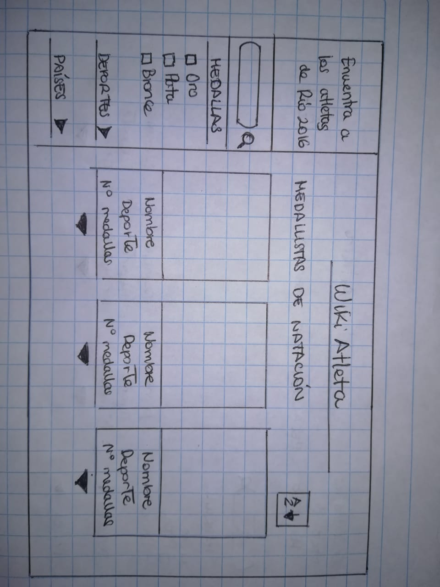
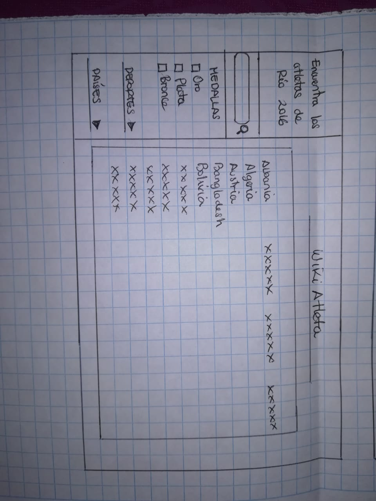
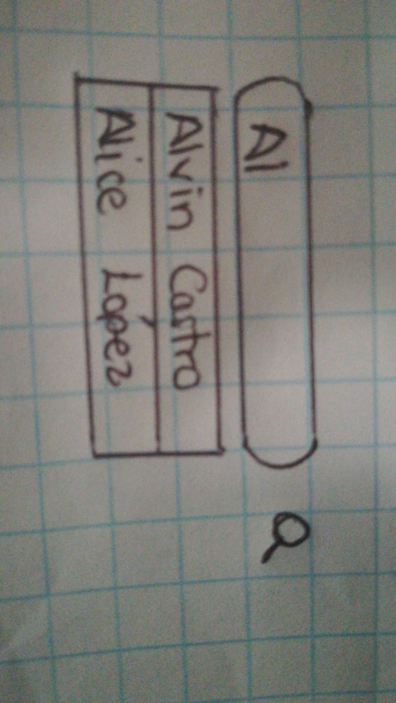

# Data Lovers
#  WIKIATLETAS
##  Definición del producto
###  Usuarios  
* ¿Quiénes son los principales usuarios de producto?    
   Los usuarios principales son atletas que competirán en las próximas olimpiadas de Tokio 2020.

* ¿Cuáles son los objetivos de estos usuarios en relación con el producto?  
  El objetivo de los atletas es instruirse, estudiar las estadísticas de Juegos Olímpicos pasados, conocer los participantes más destacados y en qué disciplinas, para analizar sus tácticas de juego a mayor profundidad.

##  Diseño de la interfaz de usuario
###  Historias de usuario y prototipo de baja fidelidad

HU 1: Yo como atleta quiero ver el top de atletas con más medallas de oro de los Juegos Olímpicos 2016 para saber quiénes son.  

HU 2: Yo como atleta quiero ver el perfil completo del atleta para conocerlo más.  

HU 3: Yo como atleta quiero ordenar los resultados de mi búsqueda para verlos en orden alfabético.  

HU 4: Yo como atleta quiero ver los medallistas de oro, plata y bronce de los Juegos Olímpicos 2016 para saber quiénes son.  

HU 5: Yo como atleta quiero ver a los medallistas de cada deporte en los Juegos Olímpicos 2016 para saber quiénes son.  

HU 6: Yo como atleta quiero ver a los medallistas de cada país en los Juegos Olímpicos 2016 para saber quiénes son.  

HU 7: Yo como atleta quiero buscar por su nombre a los atletas de los Juegos Olímpicos 2016 para ver información detallada sobre ellos.  

HU 8: Yo como atleta quiero saber quienes son los países más destacados de las olimpiadas para enterarme más sobre ellos.  

###  Prototipo de alta fidelidad

  

###  Testeos de usabilidad
 Nuestros filtros confundian al ususaro cuando se encontraba ubicado arriba de un buscador, les hacias creer que debian escribir algo primero para recien usar los filtros, para la solucion se tubo que reacomodar los filtros de manera que su uso quede mas claro

##  Objetivos de aprendizaje
### UX

- [x] Diseñar la aplicación pensando y entendiendo al usuario.
- [x] Crear prototipos para obtener _feedback_ e iterar.
- [x] Aplicar los principios de diseño visual (contraste, alineación, jerarquía).
- [x] Planear y ejecutar _tests_ de usabilidad.

### HTML y CSS

- [x] Entender y reconocer por qué es importante el HTML semántico.
- [x] Identificar y entender tipos de selectores en CSS.
- [x] Entender como funciona `flexbox` en CSS.
- [x] Construir tu aplicación respetando el diseño planeado (maquetación).

### DOM

- [x] Entender y reconocer los selectores del DOM (`querySelector` | `querySelectorAll`).
- [x] Manejar eventos del DOM. (`addEventListener`)
- [x] Manipular dinámicamente el DOM. (`createElement`, `appendchild`, `innerHTML`, `value`)

### Javascript

- [x] Manipular arrays (`filter` | `map` | `sort` | `reduce`).
- [x] Manipular objects (key | value).
- [x] Entender el uso de condicionales (`if-else` | `switch`).
- [x] Entender el uso de bucles (`for` | `forEach`).
- [ ] Entender la diferencia entre expression y statements.
- [x] Utilizar funciones (`parámetros` | `argumentos` | `valor de retorno`).
- [ ] Entender la diferencia entre tipos de datos atómicos y estructurados.
- [x] Utilizar ES Modules (`import` | `export`).

### Pruebas Unitarias (_testing_)
- [x] Testear funciones (funciones puras).

### Git y GitHub
- [x] Ejecutar comandos de git (`add` | `commit` | `pull` | `status` | `push`).
- [x] Utilizar los repositorios de GitHub (`clone` | `fork` | `gh-pages`).
- [x] Colaborar en Github (`pull requests`).

### Buenas prácticas de desarrollo
- [x] Organizar y dividir el código en módulos (Modularización).
- [x] Utilizar identificadores descriptivos (Nomenclatura | Semántica).
- [x] Utilizar linter para seguir buenas prácticas (ESLINT).