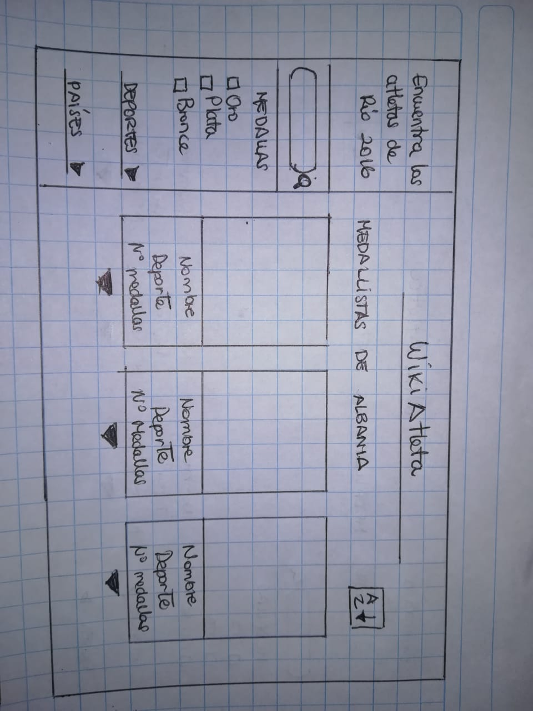
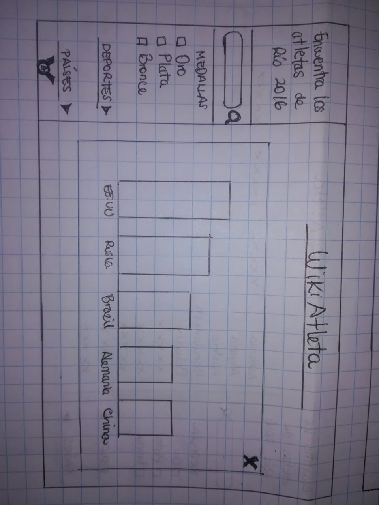

# WIKIATLETAS
## Definición del producto
* ¿Quiénes son los principales usuarios de producto?    
   Los usuari@s principales son l@s atletas que competirán en las próximas olimpiadas de Tokio 2020.

* ¿Cuáles son los objetivos de estos usuarios en relación con el    producto?  
   - Obtener información detallada sobre l@s competidor@s de las olimpiadas de Río 2016.  
   - Poder filtrar a los atlet@s por medallas que ganaron, disciplina y países.  
   - Ordenar alfabéticamente e inverso por a los atlet@s.
   - Buscar a un atleta por su nombre y ver las coincidencias. 
   - Ver gráfico de barras sobre los países que ganaron más medallas en Rio 2016(estadística). 

* ¿Cuáles son los datos más relevantes que quieren ver en la interfaz y por qué?  
   Ver información detallada de l@s atletas que buscan para saber sus características y participación en los juegos pues serán sus próximos oponentes.  

* ¿Cuándo utilizan o utilizarían el producto?   
  Durante su entrenamiento pues tanto él/ella como su entrenador(a) averiguarán sobre sus posibles oponentes. 

## Diseño de la Interfaz de Usuario
### Historias de usuario y prototipo de baja fidelidad
HU 1: Yo como atleta quiero ver el top de atletas con más medallas de oro de los Juegos Olímpicos 2016 para saber quiénes son.  

HU 2: Yo como atleta quiero ver el perfil completo del atleta para conocerlo más.  

HU 3: Yo como atleta quiero ordenar los resultados de mi búsqueda para verlos en orden alfabético.  

HU 4: Yo como atleta quiero ver los medallistas de oro, plata y bronce de los Juegos Olímpicos 2016 para saber quiénes son.  

HU 5: Yo como atleta quiero ver los medallistas de cada deporte en los Juegos Olímpicos 2016 para saber quiénes son.  

HU 6: Yo como atleta quiero ver los medallistas de cada país en los Juegos Olímpicos 2016 para saber quiénes son.  

HU 7: Yo como atleta quiero buscar por su nombre a los atletas de los Juegos Olímpicos 2016 para ver información detallada sobre ellos.  

HU 8: Yo como atleta quiero saber quienes son los países más destacados de las olimpiadas para enterarme mas sobre ellos.  

### Prototipo de alta fidelidad

  

### Testeos de usabilidad
qué problemas de usabilidad detectaste a través de los _tests_ y cómo los
mejoraste en tu propuesta final.

## Objetivos de aprendizaje
### UX

- [ ] Diseñar la aplicación pensando y entendiendo al usuario.
- [ ] Crear prototipos para obtener _feedback_ e iterar.
- [ ] Aplicar los principios de diseño visual (contraste, alineación, jerarquía).
- [ ] Planear y ejecutar _tests_ de usabilidad.

### HTML y CSS

- [ ] Entender y reconocer por qué es importante el HTML semántico.
- [ ] Identificar y entender tipos de selectores en CSS.
- [ ] Entender como funciona `flexbox` en CSS.
- [ ] Construir tu aplicación respetando el diseño planeado (maquetación).

### DOM

- [ ] Entender y reconocer los selectores del DOM (`querySelector` | `querySelectorAll`).
- [ ] Manejar eventos del DOM. (`addEventListener`)
- [ ] Manipular dinámicamente el DOM. (`createElement`, `appendchild`, `innerHTML`, `value`)

### Javascript

- [ ] Manipular arrays (`filter` | `map` | `sort` | `reduce`).
- [ ] Manipular objects (key | value).
- [ ] Entender el uso de condicionales (`if-else` | `switch`).
- [ ] Entender el uso de bucles (`for` | `forEach`).
- [ ] Entender la diferencia entre expression y statements.
- [ ] Utilizar funciones (`parámetros` | `argumentos` | `valor de retorno`).
- [ ] Entender la diferencia entre tipos de datos atómicos y estructurados.
- [ ] Utilizar ES Modules (`import` | `export`).

### Pruebas Unitarias (_testing_)
- [ ] Testear funciones (funciones puras).

### Git y GitHub
- [ ] Ejecutar comandos de git (`add` | `commit` | `pull` | `status` | `push`).
- [ ] Utilizar los repositorios de GitHub (`clone` | `fork` | `gh-pages`).
- [ ] Colaborar en Github (`pull requests`).

### Buenas prácticas de desarrollo
- [ ] Organizar y dividir el código en módulos (Modularización).
- [ ] Utilizar identificadores descriptivos (Nomenclatura | Semántica).
- [ ] Utilizar linter para seguir buenas prácticas (ESLINT).

